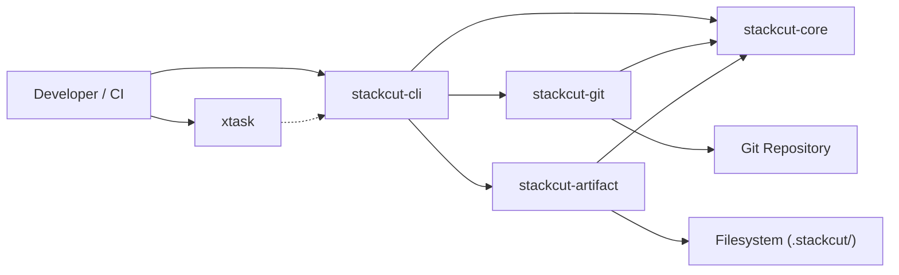
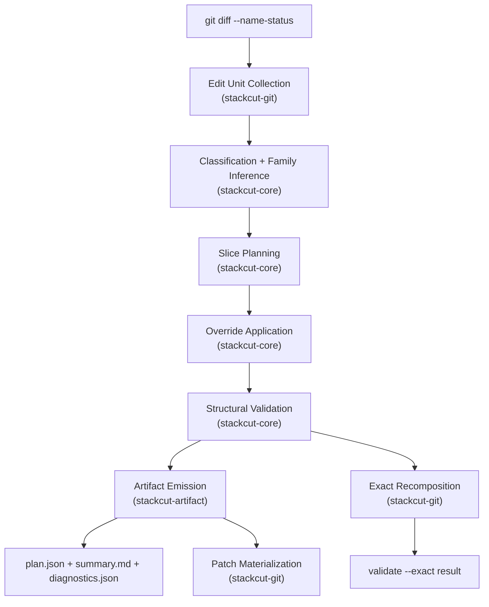
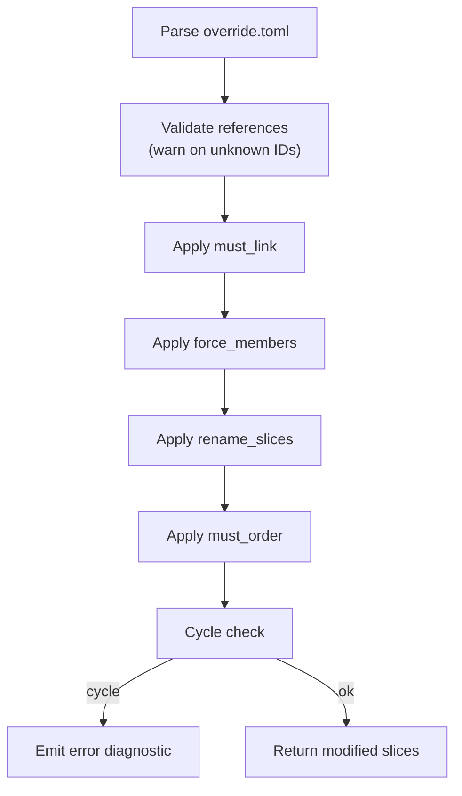

# Design Document — stackcut-v01-completion

## Overview

This design completes the stackcut v0.1 build by closing the gap between the documented contracts and the running code. The work spans six areas:

1. **Contract drift fixes** (Reqs 1–5): wire the `cargo xtask` alias, install CI tools, align the `--exact` flag with README semantics, fix config parser strictness, and verify doc cross-references.
2. **Override engine end-to-end** (Reqs 6–11): harden parsing with validation diagnostics, implement each override verb (`must_link`, `force_members`, `rename_slices`, `must_order`) with full reason tracking, and prove replay stability.
3. **Validate command promotion** (Reqs 12–13): make `validate` the single entry point for structural + exact modes with stable exit codes and version/schema enforcement.
4. **Planner deepening** (Reqs 14–17): emit `prep-refactor` slice kind, add review-budget diagnostics, strengthen ownership inference for docs/tests/generated files, and model unsupported Git surfaces.
5. **Git edge hardening** (Reqs 18–19): handle rename-with-edit, copy, type-change correctly; add `--dry-run` to materialize with rollback on partial failure.
6. **Proof surface & artifacts** (Reqs 20–26): golden tests, property tests, snapshot tests, temp-repo integration tests, plan fingerprint, richer diagnostics, and round-trip properties.

All changes respect the existing dependency direction: `stackcut-core` depends on no local crate, `stackcut-git` and `stackcut-artifact` depend only on `stackcut-core`, `stackcut-cli` depends on all three, and `xtask` depends on no local crate.

## Architecture

### System Context



### Pipeline (unchanged shape, deeper internals)



### Override Engine Pipeline (new)



The fixed application order (`must_link` → `force_members` → `rename_slices` → `must_order`) is a hard contract for replay stability.

### Exit Code Map (new)

| Code | Meaning |
|------|---------|
| 0 | Success |
| 1 | Structural validation errors |
| 2 | Exact recomposition failure |
| 3 | Override conflict (e.g., cycle introduced) |
| 4 | Unsupported Git surface encountered |
| 10 | Internal bug / unexpected panic |

### Crate Responsibility Changes

| Crate | New Responsibilities |
|-------|---------------------|
| `stackcut-core` | `prep-refactor` emission, review budget diagnostic, stronger ownership inference, unsupported surface modeling, override validation diagnostics, cycle detection on `must_order` |
| `stackcut-git` | Rename-with-edit detection (similarity < 100%), copy handling, type-change classification, `--dry-run` materialization, rollback on partial failure |
| `stackcut-artifact` | Plan fingerprint (SHA-256), richer diagnostics envelope (`source`, counts, `generated_at`), snapshot-stable rendering |
| `stackcut-cli` | Stable exit codes, `--dry-run` flag on `materialize`, version/schema enforcement on `validate`, fingerprint verification |
| `xtask` | `cargo xtask` alias via `.cargo/config.toml`, `docs-check` path verification, CI tool installation guidance |


## Components and Interfaces

### 1. Xtask Alias & CI (Reqs 1–2)

**`.cargo/config.toml`** (new file):
```toml
[alias]
xtask = "run --package xtask --"
```

**CI workflow** (`.github/workflows/ci.yml`): add `cargo install cargo-mutants` and `cargo install cargo-fuzz` steps with caching before invoking xtask commands.

### 2. Config Parser Hardening (Req 4)

```rust
// stackcut-core: config parsing additions

/// Parse stackcut.toml with strict validation.
/// - Rejects version > SUPPORTED_CONFIG_VERSION
/// - Emits warning diagnostics for unknown keys
pub fn parse_config(contents: &str) -> Result<(StackcutConfig, Vec<Diagnostic>)> {
    let mut diagnostics = Vec::new();
    let raw: toml::Value = toml::from_str(contents)?;

    // Check for unknown keys
    let known_keys = &["version", "generated_prefixes", "manifest_files",
        "lock_files", "test_prefixes", "doc_prefixes", "ops_prefixes",
        "path_families", "review_budget"];
    if let Some(table) = raw.as_table() {
        for key in table.keys() {
            if !known_keys.contains(&key.as_str()) {
                diagnostics.push(Diagnostic {
                    level: DiagnosticLevel::Warning,
                    code: "unknown-config-key".to_string(),
                    message: format!("Unknown key '{}' in stackcut.toml", key),
                });
            }
        }
    }

    let config: StackcutConfig = toml::from_str(contents)?;
    if config.version > SUPPORTED_CONFIG_VERSION {
        bail!("stackcut.toml version {} is not supported (max: {})",
              config.version, SUPPORTED_CONFIG_VERSION);
    }

    Ok((config, diagnostics))
}
```

### 3. Override Engine — Parsing & Validation (Req 6)

```rust
// stackcut-core: override validation

/// Validate parsed overrides against a plan's unit and slice IDs.
/// Returns warning diagnostics for unknown references.
pub fn validate_overrides(
    overrides: &Overrides,
    unit_ids: &BTreeSet<String>,
    slice_ids: &BTreeSet<String>,
) -> Vec<Diagnostic> {
    let mut diagnostics = Vec::new();

    // Check must_link member references
    for rule in &overrides.must_link {
        if rule.members.len() < 2 {
            diagnostics.push(warning("must-link-too-few",
                "must_link group has fewer than 2 members"));
        }
        for member in &rule.members {
            if !unit_ids.contains(member) {
                diagnostics.push(warning("unknown-override-member",
                    &format!("must_link references unknown member '{}'", member)));
            }
        }
    }

    // Check force_members references
    for rule in &overrides.force_members {
        if !unit_ids.contains(&rule.member) {
            diagnostics.push(warning("unknown-override-member",
                &format!("force_members references unknown member '{}'", rule.member)));
        }
        // slice may be created — no warning for unknown target slice
    }

    // Check rename_slices references
    for rule in &overrides.rename_slices {
        if !slice_ids.contains(&rule.id) {
            diagnostics.push(warning("unknown-override-slice",
                &format!("rename_slices references unknown slice '{}'", rule.id)));
        }
    }

    // Check must_order references
    for rule in &overrides.must_order {
        if !slice_ids.contains(&rule.before) {
            diagnostics.push(warning("unknown-override-slice",
                &format!("must_order references unknown 'before' slice '{}'", rule.before)));
        }
        if !slice_ids.contains(&rule.after) {
            diagnostics.push(warning("unknown-override-slice",
                &format!("must_order references unknown 'after' slice '{}'", rule.after)));
        }
    }

    diagnostics
}
```

### 4. Override Engine — Application (Reqs 7–11)

The existing `apply_overrides` function in `stackcut-core` already implements the four verbs in the correct fixed order. Changes needed:

1. **Cycle detection after `must_order`**: after applying all `must_order` edges, run `has_cycle()` on the resulting slices. If a cycle is detected, emit an error diagnostic with code `override-cycle` and revert the offending edge.

2. **Idempotence**: the current implementation is already structurally idempotent because `dedup_and_sort` normalizes members/depends_on after each step. No change needed beyond adding a property test to prove it.

```rust
// Addition to apply_overrides — cycle guard after must_order
for rule in &overrides.must_order {
    if let Some(slice) = slices.iter_mut().find(|s| s.id == rule.after) {
        slice.depends_on.push(rule.before.clone());
        dedup_and_sort(&mut slice.depends_on);

        // Check for cycle immediately
        if has_cycle(slices) {
            // Revert the edge
            slice.depends_on.retain(|d| d != &rule.before);
            diagnostics.push(Diagnostic {
                level: DiagnosticLevel::Error,
                code: "override-cycle".to_string(),
                message: format!(
                    "must_order '{} -> {}' would create a cycle; edge rejected",
                    rule.before, rule.after
                ),
            });
        } else {
            slice.reasons.push(reason("override-must-order",
                rule.reason.as_deref()
                    .unwrap_or("Ordering edge added by override.")));
        }
    }
}
```

### 5. Validate Command (Reqs 12–13)

```rust
// stackcut-cli: updated cmd_validate

fn cmd_validate(plan_path: &Path, exact: bool) -> Result<()> {
    let plan = read_plan(plan_path)?;

    // Version check
    if plan.version != stackcut_core::PLAN_VERSION {
        eprintln!("error: plan version '{}' is not supported (expected '{}')",
                  plan.version, stackcut_core::PLAN_VERSION);
        std::process::exit(1);
    }

    // Fingerprint verification (if present)
    if let Some(ref fp) = plan.fingerprint {
        let computed = stackcut_artifact::compute_fingerprint(&plan);
        if *fp != computed {
            eprintln!("warning: plan fingerprint mismatch (expected {}, got {})", fp, computed);
        }
    }

    // Structural validation
    let diagnostics = structural_validate(&plan);
    let has_errors = diagnostics.iter().any(|d| d.level == DiagnosticLevel::Error);

    if !diagnostics.is_empty() {
        println!("structural validation:");
        for d in &diagnostics {
            println!("  {:?} {}: {}", d.level, d.code, d.message);
        }
    } else {
        println!("structural validation: ok");
    }

    if has_errors {
        std::process::exit(1);
    }

    // Exact recomposition (only if structural passed)
    if exact {
        let repo_root = plan.source.repo_root.as_ref()
            .map(PathBuf::from)
            .context("plan missing source.repo_root")?;
        match stackcut_git::validate_exact_recomposition(&repo_root, &plan) {
            Ok(()) => println!("exact recomposition: ok"),
            Err(e) => {
                eprintln!("exact recomposition failed: {e}");
                std::process::exit(2);
            }
        }
    }

    std::process::exit(0);
}
```

### 6. Planner Deepening (Reqs 14–17)

#### 6a. prep-refactor Emission (Req 14)

In the planner, after collecting mechanical IDs, check if all members are rename-only:

```rust
let all_renames = mechanical_ids.iter().all(|id| {
    units.iter().find(|u| u.id == *id)
        .map(|u| u.status == ChangeStatus::Renamed)
        .unwrap_or(false)
});

let slice_kind = if all_renames { SliceKind::PrepRefactor } else { SliceKind::Mechanical };
```

#### 6b. Review Budget (Req 15)

Add `review_budget: Option<u32>` to `StackcutConfig` (default: 15). After all slices are built, emit a diagnostic for oversized slices:

```rust
let budget = config.review_budget.unwrap_or(15) as usize;
for slice in &slices {
    if slice.members.len() > budget {
        diagnostics.push(Diagnostic {
            level: DiagnosticLevel::Warning,
            code: "review-budget-exceeded".to_string(),
            message: format!("Slice '{}' has {} members (budget: {})",
                             slice.id, slice.members.len(), budget),
        });
    }
}
```

#### 6c. Stronger Ownership Inference (Req 16)

Enhance the attachment logic for docs/tests/generated files. Before falling through to the ambiguity path, try path-segment matching:

```rust
// For test files: check if any path segment matches a family name
fn infer_owner_by_path_segment(path: &str, family_to_slice: &BTreeMap<String, String>) -> Option<String> {
    let segments: Vec<&str> = path.split('/').collect();
    let stem = segments.last()
        .and_then(|s| s.strip_suffix(".rs").or(s.strip_suffix(".ts")))
        .unwrap_or("");

    let mut candidates = Vec::new();
    for (family, slice_id) in family_to_slice {
        if segments.iter().any(|seg| *seg == family.as_str()) || stem == family.as_str() {
            candidates.push(slice_id.clone());
        }
    }

    if candidates.len() == 1 {
        Some(candidates.into_iter().next().unwrap())
    } else {
        None // still ambiguous
    }
}
```

#### 6d. Unsupported Surface Modeling (Req 17)

In `stackcut-git::collect_edit_units`, detect unsupported changes and tag them:

```rust
// In collect_edit_units, after parsing each line:
let is_binary = is_binary_path(&path); // heuristic or use git diff --numstat
let is_submodule = path == ".gitmodules" || is_gitlink_change(repo, &path, head);
let is_symlink = is_symlink_in_tree(repo, &path, head);
let is_mode_only = status_char == 'M' && has_no_content_diff(repo, base, head, &path);

if is_binary {
    unit.notes.push("unsupported-binary".to_string());
}
// ... similar for submodule, symlink, mode-only
```

In the planner, units with unsupported notes get a dedicated `misc` slice and a warning diagnostic:

```rust
for note in &unit.notes {
    if note.starts_with("unsupported-") {
        diagnostics.push(Diagnostic {
            level: DiagnosticLevel::Warning,
            code: note.clone(),
            message: format!("{} is an unsupported change type in v0.1", unit.path),
        });
    }
}
```

### 7. Git Edge Hardening (Reqs 18–19)

#### 7a. Rename/Copy/Type-Change (Req 18)

Update `collect_edit_units` to parse the similarity index from rename lines:

```rust
'R' => {
    let similarity = code[1..].parse::<u32>().unwrap_or(100);
    let status = if similarity < 100 {
        ChangeStatus::Modified // rename-with-edit → behavior, not mechanical
    } else {
        ChangeStatus::Renamed
    };
    // ...
}
'T' => {
    // Type change (file ↔ symlink)
    (ChangeStatus::Unknown, None, parts.next().unwrap_or_default().to_string())
    // Emit diagnostic in planner
}
```

#### 7b. Dry-Run Materialization (Req 19)

```rust
// stackcut-git

pub fn materialize_patches(
    repo: &Path,
    plan: &Plan,
    out_dir: &Path,
    dry_run: bool,
) -> Result<Vec<PathBuf>> {
    let repo_root = discover_repo_root(repo)?;

    // In dry-run mode, verify patches apply without writing
    if dry_run {
        let temp = tempdir()?;
        let paths = do_materialize(&repo_root, plan, temp.path())?;
        // Verify each patch applies cleanly
        for patch in &paths {
            run_git_capture(Some(&repo_root), &["apply", "--check", &patch.display().to_string()])?;
        }
        return Ok(paths);
    }

    // Normal mode with rollback on failure
    fs::create_dir_all(out_dir)?;
    let mut written = Vec::new();
    match do_materialize(&repo_root, plan, out_dir) {
        Ok(paths) => Ok(paths),
        Err(e) => {
            // Rollback: remove partially written patches
            for path in &written {
                let _ = fs::remove_file(path);
            }
            Err(e)
        }
    }
}
```

### 8. Artifact Fingerprint (Req 24)

```rust
// stackcut-artifact

use sha2::{Sha256, Digest};

/// Compute SHA-256 fingerprint of plan content, excluding the fingerprint field.
pub fn compute_fingerprint(plan: &Plan) -> String {
    let mut plan_copy = plan.clone();
    plan_copy.fingerprint = None;
    let json = serde_json::to_string(&plan_copy).unwrap_or_default();
    let hash = Sha256::digest(json.as_bytes());
    format!("{:x}", hash)
}
```

Add `fingerprint: Option<String>` to the `Plan` struct (with `#[serde(skip_serializing_if = "Option::is_none")]`).

### 9. Richer Diagnostics Envelope (Req 25)

```rust
// stackcut-artifact

#[derive(Debug, Clone, Serialize, Deserialize)]
pub struct DiagnosticsEnvelope {
    pub source_base: String,
    pub source_head: String,
    pub generated_at: String, // ISO-8601
    pub counts: DiagnosticCounts,
    pub diagnostics: Vec<Diagnostic>,
}

#[derive(Debug, Clone, Serialize, Deserialize)]
pub struct DiagnosticCounts {
    pub errors: usize,
    pub warnings: usize,
    pub notes: usize,
}

pub fn write_diagnostics_envelope(
    path: &Path,
    plan: &Plan,
) -> Result<()> {
    let envelope = DiagnosticsEnvelope {
        source_base: plan.source.base.clone(),
        source_head: plan.source.head.clone(),
        generated_at: chrono::Utc::now().to_rfc3339(),
        counts: DiagnosticCounts {
            errors: plan.diagnostics.iter().filter(|d| d.level == DiagnosticLevel::Error).count(),
            warnings: plan.diagnostics.iter().filter(|d| d.level == DiagnosticLevel::Warning).count(),
            notes: plan.diagnostics.iter().filter(|d| d.level == DiagnosticLevel::Note).count(),
        },
        diagnostics: plan.diagnostics.clone(),
    };
    let json = serde_json::to_string_pretty(&envelope)?;
    fs::write(path, format!("{json}\n"))?;
    Ok(())
}
```

### 10. Docs-Check Path Verification (Req 5)

```rust
// xtask: docs-check enhancement

fn docs_check() -> Result<()> {
    let doc_files = &[
        "README.md", "AGENTS.md", "TESTING.md", "RELEASE.md", "docs/ARCHITECTURE.md"
    ];
    let mut broken = Vec::new();

    for doc_file in doc_files {
        let contents = fs::read_to_string(doc_file)?;
        // Extract file path references (backtick-quoted paths, markdown links)
        for path_ref in extract_path_references(&contents) {
            if !Path::new(&path_ref).exists() {
                broken.push((doc_file.to_string(), path_ref));
            }
        }
    }

    if broken.is_empty() {
        println!("docs-check: all references valid");
        Ok(())
    } else {
        for (doc, path) in &broken {
            eprintln!("broken reference in {}: {}", doc, path);
        }
        bail!("docs-check found {} broken references", broken.len());
    }
}
```

## Data Models

### Modified `Plan` Struct

```rust
#[derive(Debug, Clone, Serialize, Deserialize, JsonSchema, PartialEq, Eq)]
pub struct Plan {
    pub version: String,
    pub source: PlanSource,
    pub units: Vec<EditUnit>,
    pub slices: Vec<Slice>,
    #[serde(default, skip_serializing_if = "Vec::is_empty")]
    pub ambiguities: Vec<Ambiguity>,
    #[serde(default, skip_serializing_if = "Vec::is_empty")]
    pub diagnostics: Vec<Diagnostic>,
    #[serde(default, skip_serializing_if = "Option::is_none")]
    pub fingerprint: Option<String>,  // NEW: SHA-256 of plan content
}
```

### Modified `StackcutConfig` Struct

```rust
#[derive(Debug, Clone, Serialize, Deserialize, JsonSchema, PartialEq, Eq)]
pub struct StackcutConfig {
    #[serde(default = "default_version")]
    pub version: u32,
    #[serde(default)]
    pub generated_prefixes: Vec<String>,
    #[serde(default)]
    pub manifest_files: Vec<String>,
    #[serde(default)]
    pub lock_files: Vec<String>,
    #[serde(default)]
    pub test_prefixes: Vec<String>,
    #[serde(default)]
    pub doc_prefixes: Vec<String>,
    #[serde(default)]
    pub ops_prefixes: Vec<String>,
    #[serde(default)]
    pub path_families: Vec<PathFamilyRule>,
    #[serde(default)]
    pub review_budget: Option<u32>,  // NEW: max files per slice (default 15)
}
```

### New `DiagnosticsEnvelope` Struct

```rust
#[derive(Debug, Clone, Serialize, Deserialize)]
pub struct DiagnosticsEnvelope {
    pub source_base: String,
    pub source_head: String,
    pub generated_at: String,
    pub counts: DiagnosticCounts,
    pub diagnostics: Vec<Diagnostic>,
}

#[derive(Debug, Clone, Serialize, Deserialize)]
pub struct DiagnosticCounts {
    pub errors: usize,
    pub warnings: usize,
    pub notes: usize,
}
```

### Updated `schema/stackcut.plan.schema.json`

Add to the plan object's `properties`:

```json
"fingerprint": {
  "type": ["string", "null"],
  "description": "SHA-256 hash of plan content excluding this field"
}
```

### Updated `schema/stackcut.override.schema.json`

No structural changes needed. The schema already covers all four override verbs. Validation of references against plan IDs happens at runtime, not in the schema.

### Exit Code Enum (stackcut-cli)

```rust
#[repr(u8)]
pub enum ExitCode {
    Success = 0,
    StructuralError = 1,
    RecompositionFailure = 2,
    OverrideConflict = 3,
    UnsupportedSurface = 4,
    InternalBug = 10,
}
```

### Diagnostic Code Registry

| Code | Level | Source | Description |
|------|-------|--------|-------------|
| `empty-slice` | Warning | structural_validate | Slice has no members |
| `self-dependency` | Error | structural_validate | Slice depends on itself |
| `missing-dependency` | Error | structural_validate | Dependency references unknown slice |
| `duplicate-member` | Error | structural_validate | Unit appears in multiple slices |
| `missing-member` | Error | structural_validate | Unit not assigned to any slice |
| `cycle` | Error | structural_validate | Dependency graph has a cycle |
| `ambiguity-present` | Warning | plan | Plan contains ambiguities |
| `review-budget-exceeded` | Warning | plan | Slice exceeds file count budget |
| `override-cycle` | Error | apply_overrides | must_order would create cycle |
| `unknown-config-key` | Warning | parse_config | Unknown key in stackcut.toml |
| `unknown-override-member` | Warning | validate_overrides | Override references unknown member |
| `unknown-override-slice` | Warning | validate_overrides | Override references unknown slice |
| `must-link-too-few` | Warning | validate_overrides | must_link group has < 2 members |
| `unsupported-binary` | Warning | plan | Binary file change |
| `unsupported-submodule` | Warning | plan | Submodule change |
| `unsupported-symlink` | Warning | plan | Symlink change |
| `unsupported-mode-only` | Warning | plan | Mode-only change |
| `fingerprint-mismatch` | Warning | validate | Plan fingerprint does not match |


## Correctness Properties

*A property is a characteristic or behavior that should hold true across all valid executions of a system — essentially, a formal statement about what the system should do. Properties serve as the bridge between human-readable specifications and machine-verifiable correctness guarantees.*

### Property 1: Plan JSON Round-Trip

*For any* valid `Plan` struct, serializing to JSON via `serde_json::to_string_pretty` and then deserializing back via `serde_json::from_str` shall produce a `Plan` that is equal to the original.

**Validates: Requirements 26.1**

### Property 2: Overrides TOML Round-Trip

*For any* valid `Overrides` struct, serializing to TOML via `toml::to_string` and then deserializing back via `toml::from_str` shall produce an `Overrides` that is equal to the original.

**Validates: Requirements 6.5, 26.2**

### Property 3: StackcutConfig TOML Round-Trip

*For any* valid `StackcutConfig` struct, serializing to TOML via `toml::to_string` and then deserializing back via `toml::from_str` shall produce a `StackcutConfig` that is equal to the original.

**Validates: Requirements 26.3**

### Property 4: No-Loss No-Duplication Invariant

*For any* valid set of `EditUnit` values, after running the planner with default config and empty overrides, every unit ID shall appear in exactly one slice's `members` list — no unit is lost and no unit is duplicated.

**Validates: Requirements 21.1**

### Property 5: Acyclic Dependency Graph

*For any* valid set of `EditUnit` values, after running the planner with default config and empty overrides, the slice dependency graph shall be acyclic (topological sort succeeds).

**Validates: Requirements 21.2**

### Property 6: Planner Determinism

*For any* valid set of `EditUnit` values and any valid `StackcutConfig` and `Overrides`, running the planner twice on the same input shall produce identical `Plan` structs.

**Validates: Requirements 21.3**

### Property 7: Override Preserves No-Loss No-Duplication

*For any* valid set of `EditUnit` values and any valid `Overrides`, after running the planner (which includes override application), every unit ID shall appear in exactly one slice — the no-loss and no-duplication invariants are preserved through override application.

**Validates: Requirements 21.4**

### Property 8: Override Idempotence

*For any* valid `Plan` (with slices already computed) and any valid `Overrides`, applying `apply_overrides` once and then applying it again to the result shall produce an identical plan. That is, `apply(apply(plan, overrides), overrides) == apply(plan, overrides)`.

**Validates: Requirements 11.1**

### Property 9: must_link Consolidation

*For any* plan and any `must_link` override group where all listed members exist in the plan's units, after override application all listed members shall reside in the same slice, and that slice shall contain an `InclusionReason` with code `"override-must-link"`.

**Validates: Requirements 7.1, 7.2, 7.4**

### Property 10: force_members Placement

*For any* plan and any `force_members` override where the member exists in the plan's units, after override application the member shall appear in the target slice and in no other slice, and the target slice shall contain an `InclusionReason` with code `"override-force-member"`.

**Validates: Requirements 8.1, 8.3**

### Property 11: rename_slices Title Update

*For any* plan and any `rename_slices` override where the slice ID exists in the plan, after override application the matching slice's `title` field shall equal the override's `title` value.

**Validates: Requirements 9.1**

### Property 12: must_order Edge Addition

*For any* plan and any `must_order` override where both `before` and `after` slice IDs exist and the edge does not create a cycle, after override application the `after` slice's `depends_on` shall contain the `before` slice ID, and the `after` slice shall contain an `InclusionReason` with code `"override-must-order"`.

**Validates: Requirements 10.1, 10.3**

### Property 13: prep-refactor vs Mechanical Kind

*For any* set of `EditUnit` values that includes mechanical (rename/copy) units, the planner shall emit the mechanical slice with kind `prep-refactor` if and only if all members of that slice have status `renamed`. If any member has a non-rename status, the kind shall be `mechanical`.

**Validates: Requirements 14.1, 14.2**

### Property 14: Review Budget Diagnostic

*For any* plan where at least one slice has more members than the configured `review_budget` (or the default of 15), the plan's diagnostics shall contain a warning with code `"review-budget-exceeded"` naming that slice.

**Validates: Requirements 15.1**

### Property 15: Ownership Inference Attachment

*For any* set of `EditUnit` values containing a docs, test, or generated file whose path uniquely identifies exactly one behavior family (via path segment or prefix matching), the planner shall attach that file to the corresponding behavior slice rather than leaving it standalone.

**Validates: Requirements 16.1, 16.2, 16.3**

### Property 16: Unsupported Surface Handling

*For any* `EditUnit` with an unsupported note (`unsupported-binary`, `unsupported-submodule`, `unsupported-symlink`, `unsupported-mode-only`), the plan shall contain a warning diagnostic with the matching code, and the unit shall be assigned to a slice (not dropped).

**Validates: Requirements 17.1, 17.2, 17.3, 17.4, 17.5**

### Property 17: Rename Similarity Classification

*For any* Git rename where the similarity index is below 100%, the resulting `EditUnit` shall have kind `behavior` (not `mechanical`), because the file was edited in addition to being renamed.

**Validates: Requirements 18.1**

### Property 18: Copy and Type-Change Classification

*For any* Git copy change, the resulting `EditUnit` shall have status `copied` and a non-`None` `old_path`. *For any* Git type change, the resulting `EditUnit` shall have status `unknown`.

**Validates: Requirements 18.2, 18.3**

### Property 19: Unknown Config Keys Warning

*For any* TOML string that parses as a valid `StackcutConfig` but contains at least one key not in the known key set, `parse_config` shall return a diagnostic with code `"unknown-config-key"` for each unknown key.

**Validates: Requirements 4.2**

### Property 20: Unsupported Config Version Rejection

*For any* `stackcut.toml` content where the `version` field is greater than the supported version constant, `parse_config` shall return an error (not a successful parse).

**Validates: Requirements 4.3**

### Property 21: Override Validation Warnings

*For any* `Overrides` struct and any set of known unit IDs and slice IDs, `validate_overrides` shall emit a warning for each member reference not in the unit ID set, each slice reference not in the slice ID set, and each `must_link` group with fewer than 2 members.

**Validates: Requirements 6.2, 6.3, 6.4**

### Property 22: Unsupported Plan Version Rejection

*For any* plan JSON where the `version` field does not equal `PLAN_VERSION`, the validate command shall reject the plan with a non-zero exit.

**Validates: Requirements 13.1**

### Property 23: Diagnostics Envelope Completeness

*For any* `Plan`, the diagnostics envelope produced by `write_diagnostics_envelope` shall contain `source_base` equal to `plan.source.base`, `source_head` equal to `plan.source.head`, correct error/warning/note counts matching the plan's diagnostics, and a `generated_at` field that parses as a valid ISO-8601 timestamp.

**Validates: Requirements 25.1, 25.2**

### Property 24: Fingerprint Verification

*For any* valid `Plan`, computing the fingerprint, storing it in the plan's `fingerprint` field, serializing the plan, deserializing it, and recomputing the fingerprint shall yield the same hash value.

**Validates: Requirements 24.1**

### Property 25: Golden Fixture Match

*For all* fixture cases under `fixtures/cases/`, loading `input.units.json`, running the planner with default config and empty overrides, and comparing the resulting plan's slices, members, dependencies, kinds, and ambiguities to `expected.plan.json` shall produce an exact match.

**Validates: Requirements 20.1**

### Property 26: End-to-End Recomposition

*For any* temporary Git repository with a known base and head commit containing file additions, modifications, renames, and multi-family splits, running the full `plan → materialize → validate --exact` pipeline shall succeed — the applied patch series produces a tree identical to the head tree.

**Validates: Requirements 23.3**


## Error Handling

### Exit Code Strategy

The CLI uses a fixed exit code map (see Data Models). Every command path must resolve to exactly one exit code. The `main` function wraps all subcommands in a top-level catch that maps `anyhow::Error` to exit code 10 (internal bug) unless a more specific code was already set.

```rust
fn main() {
    let code = match run() {
        Ok(code) => code,
        Err(e) => {
            eprintln!("internal error: {e:#}");
            10
        }
    };
    std::process::exit(code);
}
```

### Error Propagation by Crate

| Crate | Error Strategy |
|-------|---------------|
| `stackcut-core` | Returns `Vec<Diagnostic>` for validation. Pure functions never panic. Override conflicts are diagnostics, not panics. |
| `stackcut-git` | Returns `anyhow::Result` for Git operations. Wraps Git stderr in context messages. |
| `stackcut-artifact` | Returns `anyhow::Result` for IO. Fingerprint mismatches are warnings, not errors. |
| `stackcut-cli` | Maps diagnostics and errors to exit codes. Never calls `unwrap()` or `expect()` on user-facing paths. |
| `xtask` | Returns `anyhow::Result`. Exits non-zero on any failure. |

### Override Conflict Handling

1. `must_link` with unknown members → warning diagnostic, skip unknown members, apply to known ones
2. `force_members` with unknown member → warning diagnostic, skip
3. `rename_slices` with unknown slice → warning diagnostic, skip
4. `must_order` creating a cycle → error diagnostic, revert the edge, continue with remaining overrides
5. Multiple overrides targeting the same member → last-writer-wins within each verb, deterministic because of fixed application order

### Git Edge Errors

1. Patch generation failure → `anyhow::Error` with the failing slice ID and Git stderr
2. Patch application failure during materialization → rollback written patches, report which patch failed
3. Exact recomposition tree mismatch → report expected vs actual tree hash, exit code 2
4. Missing `repo_root` or `head_tree` in plan → descriptive error, exit code 1

### Diagnostics as First-Class Output

Diagnostics are not just log messages — they are structured output written to `diagnostics.json`. Every warning and error emitted during planning or validation appears in the diagnostics array. The CLI prints them to stderr and also persists them to the diagnostics file.

## Testing Strategy

### Dual Testing Approach

This feature uses both unit/integration tests and property-based tests. They are complementary:

- **Unit tests** verify specific examples, edge cases, and error conditions
- **Property tests** verify universal invariants across randomly generated inputs
- Together they provide comprehensive coverage: unit tests catch concrete regressions, property tests discover edge cases humans miss

### Property-Based Testing Configuration

- **Library**: [`proptest`](https://crates.io/crates/proptest) (the standard Rust PBT library)
- **Do not** implement property-based testing from scratch
- Each property test runs a **minimum of 100 iterations** (configured via `proptest::test_runner::Config`)
- Each property test is tagged with a comment referencing the design property:
  ```rust
  // Feature: stackcut-v01-completion, Property 4: No-loss no-duplication invariant
  ```
- Tag format: **Feature: stackcut-v01-completion, Property {number}: {property_text}**
- Each correctness property is implemented by a **single** property-based test function

### Test Organization by Crate

#### `stackcut-core` (unit + property tests)

Unit tests:
- Config parsing: documented sample parses, unknown keys warn, unsupported version rejects
- Override validation: unknown member/slice warnings, must_link too-few warning
- Planner: fixture-driven golden tests (Req 20), prep-refactor emission, review budget diagnostic
- Structural validation: empty slice, self-dependency, missing dependency, duplicate member, missing member, cycle detection

Property tests (in `tests/properties.rs` or inline):
- **Property 4**: No-loss no-duplication — generate random `Vec<EditUnit>`, run planner, assert each ID in exactly one slice
- **Property 5**: Acyclic dependency graph — generate random units, run planner, assert no cycle
- **Property 6**: Planner determinism — generate random units + config + overrides, run twice, assert equal
- **Property 7**: Override preserves invariants — generate random units + overrides, run planner, assert no-loss/no-dup
- **Property 8**: Override idempotence — generate plan + overrides, apply twice, assert equal
- **Property 9**: must_link consolidation — generate plan + must_link, assert members in same slice with reason
- **Property 10**: force_members placement — generate plan + force_members, assert member in target only with reason
- **Property 11**: rename_slices title — generate plan + rename, assert title updated
- **Property 12**: must_order edge — generate plan + must_order (no cycle), assert edge and reason
- **Property 13**: prep-refactor kind — generate mechanical units (all renames vs mixed), assert correct kind
- **Property 14**: Review budget diagnostic — generate plan with large slices, assert diagnostic present
- **Property 15**: Ownership inference — generate units with unambiguous family paths, assert attachment
- **Property 16**: Unsupported surface — generate units with unsupported notes, assert diagnostics and assignment
- **Property 19**: Unknown config keys — generate TOML with extra keys, assert warnings
- **Property 20**: Unsupported config version — generate version > supported, assert error
- **Property 21**: Override validation warnings — generate overrides with unknown refs, assert warnings

Generators needed:
- `arb_edit_unit()` — random EditUnit with valid id, path, status, kind, family
- `arb_edit_units()` — Vec of 1–50 random EditUnits with unique IDs
- `arb_overrides(units, slices)` — random Overrides referencing existing unit/slice IDs
- `arb_config()` — random StackcutConfig with valid fields

#### `stackcut-artifact` (unit + property tests)

Unit tests:
- Snapshot tests for `render_summary` output per fixture (Req 22.1)
- Snapshot tests for diagnostics serialization per fixture (Req 22.2)
- Fingerprint computation and verification

Property tests:
- **Property 1**: Plan JSON round-trip — generate random Plan, serialize/deserialize, assert equal
- **Property 2**: Overrides TOML round-trip — generate random Overrides, serialize/deserialize, assert equal
- **Property 3**: StackcutConfig TOML round-trip — generate random Config, serialize/deserialize, assert equal
- **Property 23**: Diagnostics envelope completeness — generate random Plan, write envelope, assert fields
- **Property 24**: Fingerprint round-trip — generate Plan, compute fingerprint, store, serialize, deserialize, recompute, assert match

Generators needed:
- `arb_plan()` — random Plan with valid structure (reuses `arb_edit_units` + planner)
- `arb_diagnostics()` — random Vec<Diagnostic>

#### `stackcut-git` (unit + property tests)

Unit tests:
- Name-status parsing: rename with similarity < 100%, copy, type-change
- Dry-run materialization with temp repo
- Rollback on partial failure

Property tests:
- **Property 17**: Rename similarity classification — generate rename lines with similarity < 100%, assert kind is behavior
- **Property 18**: Copy and type-change classification — generate copy/type-change lines, assert correct status/old_path

Generators needed:
- `arb_diff_line()` — random git diff --name-status line

#### `stackcut-cli` (integration tests)

Unit tests:
- Snapshot tests for `--help` output per subcommand (Req 22.3)
- Exit code tests: structural error → 1, recomposition failure → 2, override conflict → 3
- Version mismatch rejection
- Fingerprint mismatch warning

Integration tests (temp-repo):
- **Property 25**: Golden fixture match — iterate fixtures, run planner, compare
- **Property 26**: End-to-end recomposition — create temp repo, run full pipeline, assert success
- Temp-repo scenarios: simple add, simple modify, rename, multi-family split (Req 23.4)

Property tests:
- **Property 22**: Unsupported plan version — generate version strings ≠ PLAN_VERSION, assert rejection

#### `xtask` (integration tests)

- Verify `.cargo/config.toml` alias exists and is correct (Req 1)
- Verify `docs-check` catches broken references (Req 5)

### Snapshot Discipline

Per TESTING.md, snapshot or golden changes must explain what changed, why the old artifact was wrong, and what fixture pins the new behavior. All snapshot tests use `insta` or direct file comparison against `fixtures/cases/*/expected.plan.json`.

### Mutation Testing

The `cargo xtask mutants` command runs `cargo-mutants` on the workspace. The policy is mutation-on-diff for semantic planner changes and scheduled deeper sweeps for critical planner logic. Property tests significantly improve mutation kill rates because they exercise many input combinations.
